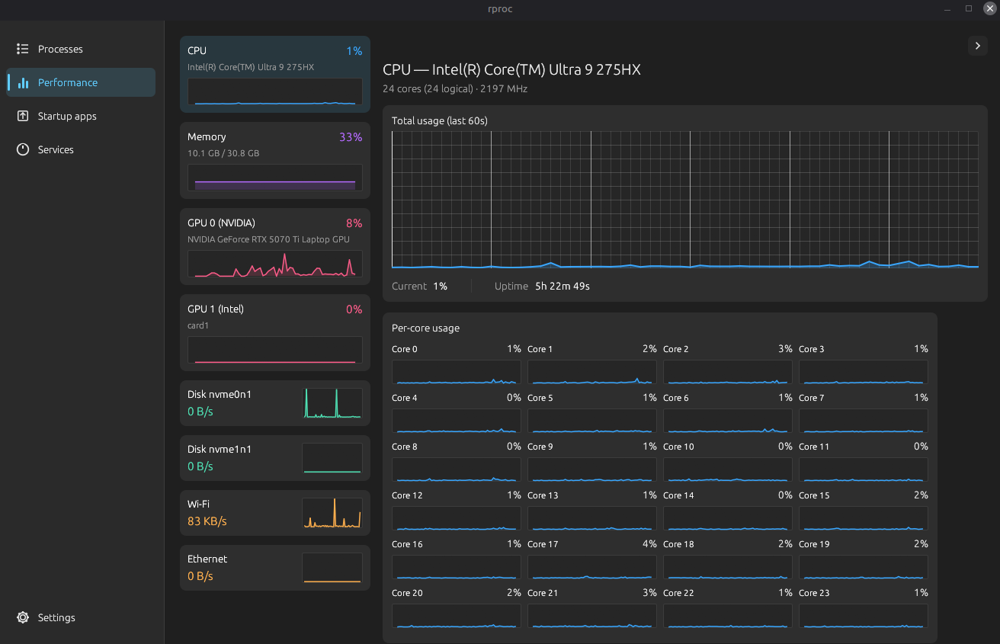
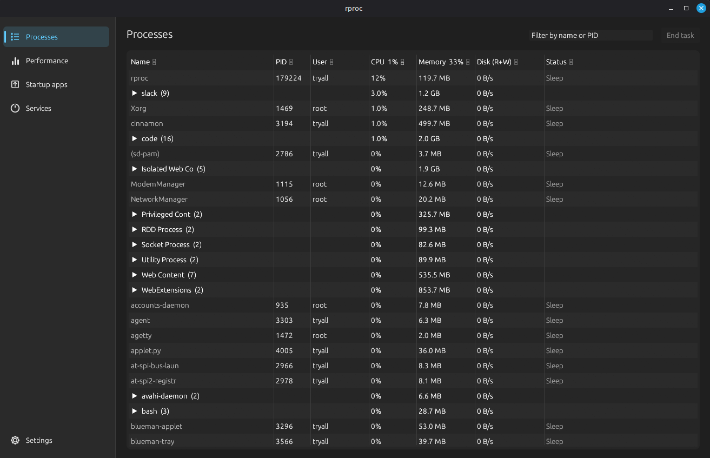
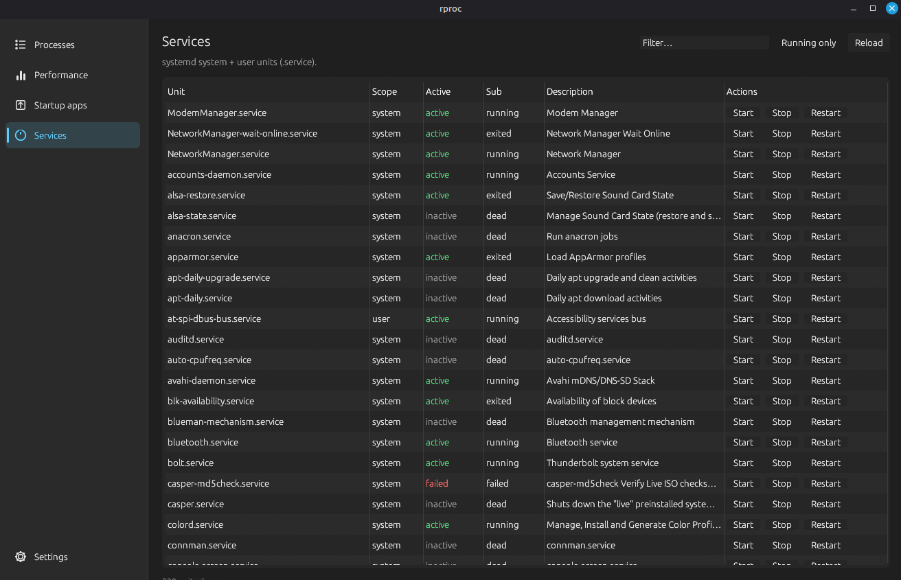

# rproc

A resource & process monitor for Linux, inspired by the Windows 11 Task Manager.

Built in Rust with [`egui`](https://github.com/emilk/egui).

<p align="center">
  
</p>

## Features

- **Processes**: CPU, memory, disk I/O, threads, status. Sort, filter, kill.
- **Performance**: live charts for CPU (global + per-core), memory, disks, network, GPU (NVIDIA / AMD / Intel).
- **Startup**: XDG autostart entries and enabled systemd units.
- **Services**: systemctl system and user units.
- **Settings**: adjustable refresh rate.

<p align="center">
  
  
</p>

## Requirements

- Linux (X11 or Wayland)
- Rust (stable), install via [rustup](https://rustup.rs/)
- `systemctl` for the Services and Startup tabs
- NVIDIA driver for NVIDIA GPU metrics (optional)

## Build & run

```bash
cargo run --release
```

## License

MIT
